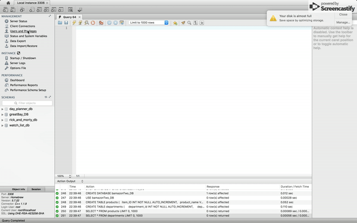

# Store Inventory (Bamazon)
This is a node.js application which interacts with MySQL. It has different user-interface depending on the user's status. It can be one of three types: `Customer`, `Manager`, `Supervisor`.
* A customer can purchase items from the store
  * 
  
* A manager can: 
  * View products
  * View low inventory
  * Add to inventory
  * Add new product 
  * 
  
* A supervisor can:
  * View product sales by department
  * Create new department
  * 
  


## Requirements and Setup

**Install**
* [Node](https://nodejs.org/en/download/) - &#x1F534; **_IMPORTANT!!!!! make sure you have at least Node version 7.6 for [async/await](https://developer.mozilla.org/en-US/docs/Web/JavaScript/Reference/Statements/async_function) to run properly._** &#x1F534;
* [MySQL Workbench](https://dev.mysql.com/downloads/workbench/)
* [MySQL Community Server](https://dev.mysql.com/downloads/mysql/)


## Terminal: Getting Started How to
**1) Run the following commands in your terminal**

```
git clone
https://github.com/Unobtainiumrock/bamazon.git

cd bamazon/

npm install
```
**2) Open and run the schema.sql in MySQL workbench**

* 
* note: make sure to click the lightning bolt like shown in the gif.

**3) Open and run the seeds.sql in MySQL**

* 
* note: make sure to click the lightning bolt like shown in the gif.

**4) Run the following terminal command from the root directory of the app**
```
node index.js
```

If done correctly, the app should boot up and display an interface similar to the ones shown in the demo gifs above.

## Built With

* [Javascript](https://eloquentjavascript.net/)
* [Node](https://nodejs.org/en/)
* [MySQL](https://www.mysql.com/)

#### Node modules Used
* [mysql](https://github.com/mysqljs/mysql)
* [cli-table](https://github.com/Automattic/cli-table)
* [inquirer](https://github.com/SBoudrias/Inquirer.js)


## Authors

* **Unobtainiumrock**

## License

This project is licensed under the MIT License - see the [LICENSE.md](LICENSE.md) file for details

## Acknowledgments

* Pineapple goes well on pizza
* Cats
* Trees
* Unobtainiumrock Industries ®

